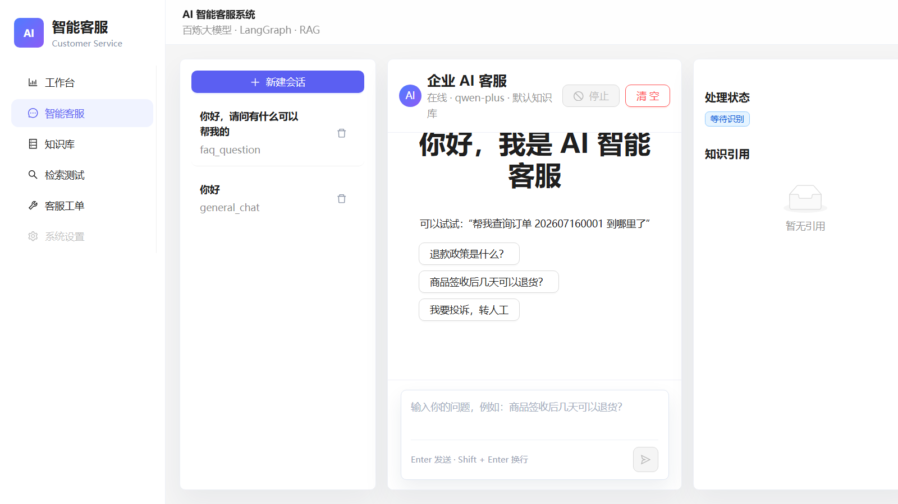
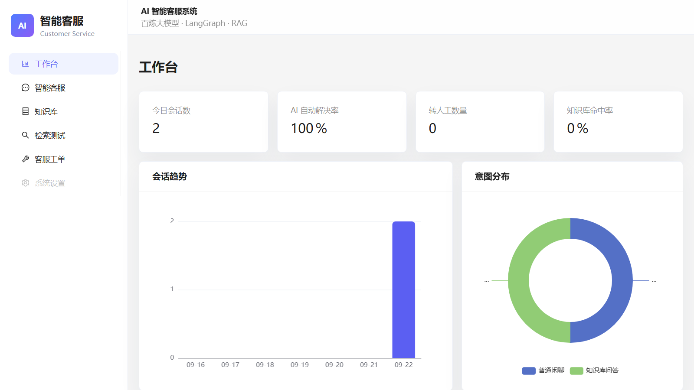
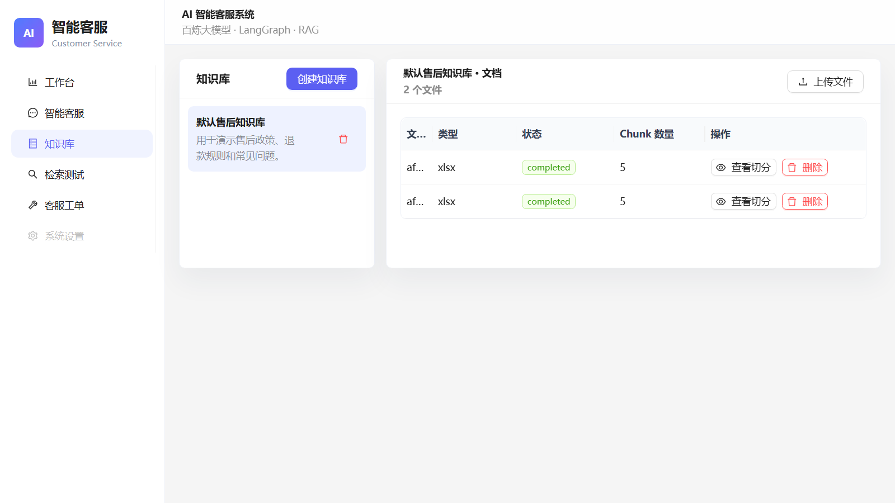
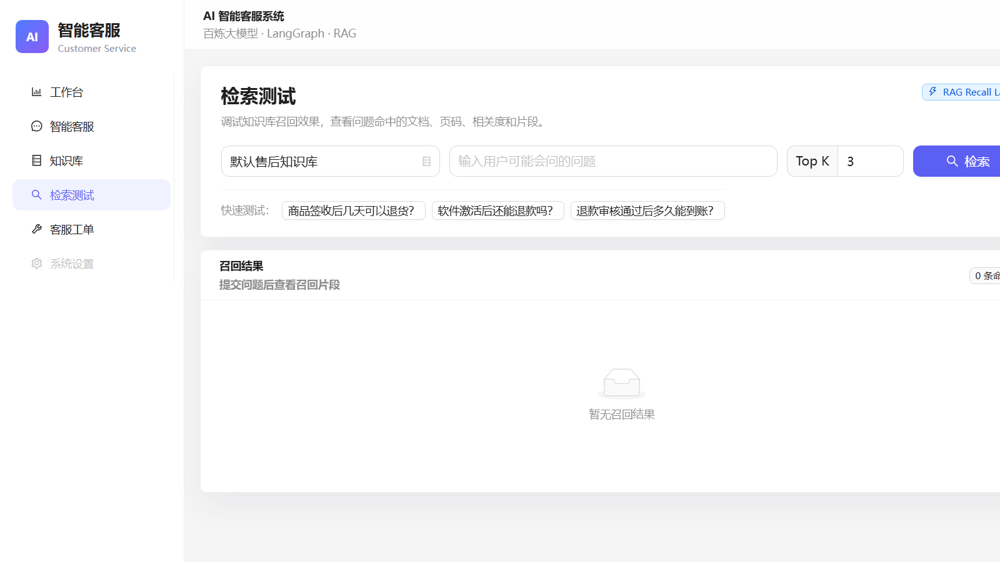
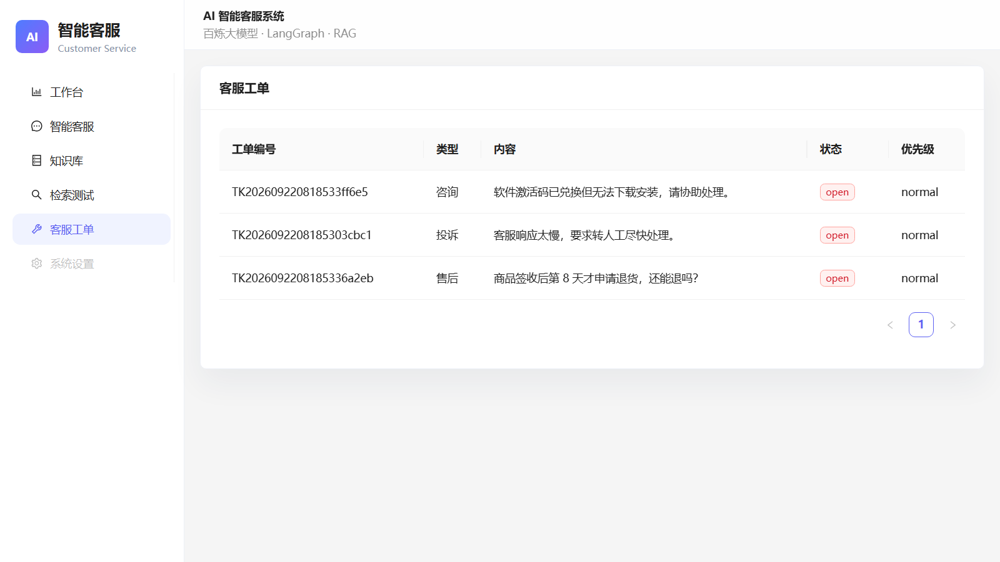
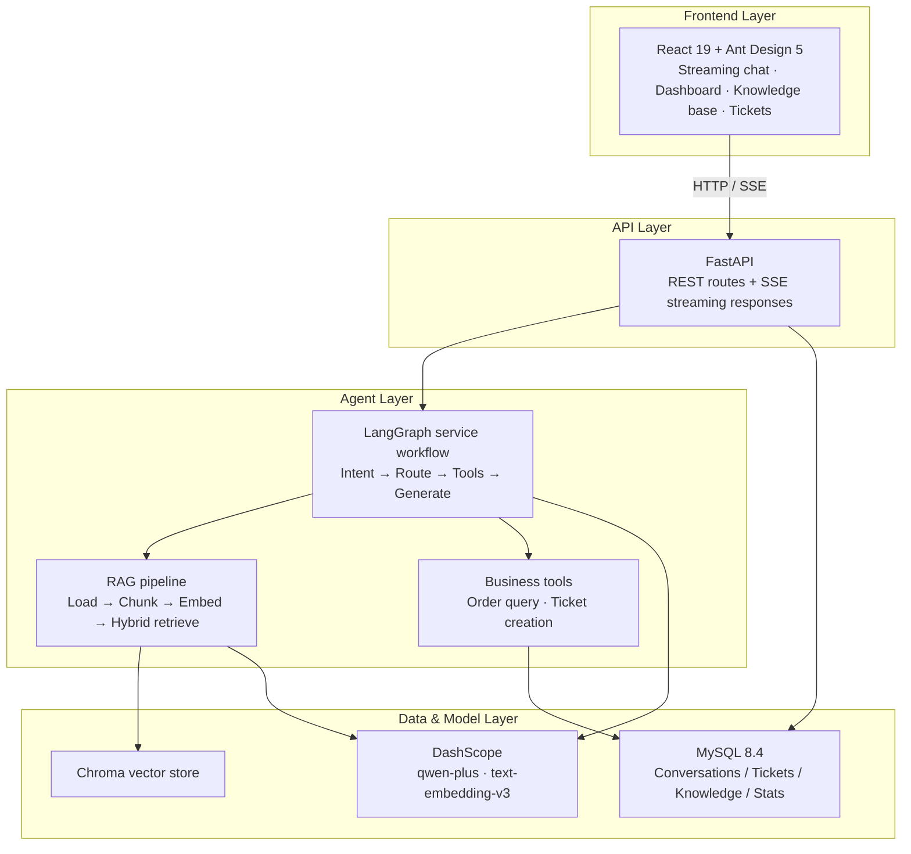
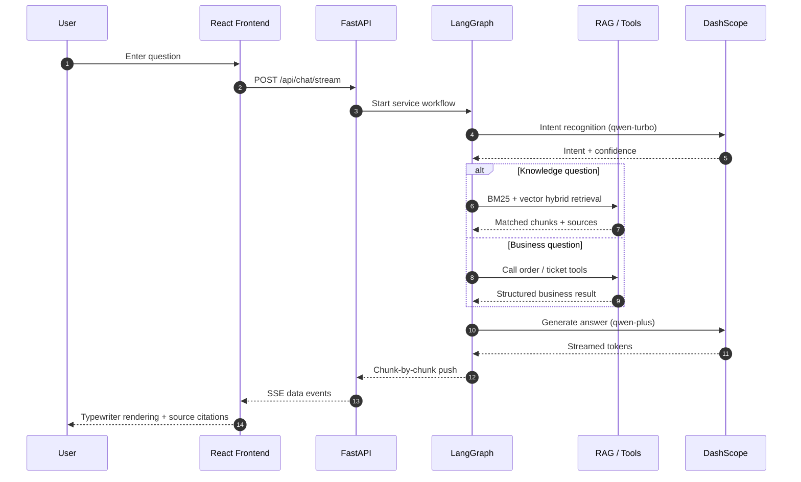

<p align="center">
  <a href="README.md">简体中文</a> · <b>English</b>
</p>

<h1 align="center">AI Customer Service System</h1>

<p align="center">
  <b>A RAG + Multi-Agent Conversation System for E-Commerce Customer Service</b><br>
  <sub>React 19 · FastAPI · LangGraph · Chroma · MySQL 8.4 · DashScope</sub>
</p>

<p align="center">
  <a href="LICENSE"></a>
  
  
  
  
  
</p>

<p align="center">
  <a href="https://github.com/wang21225/AI-Smart-Customer-Service-Assistant"></a>
  <a href="https://gitee.com/wmy221/faq-smart-ai-assistant"></a>
</p>

---

|  |  |
| :--- | :--- |
| **In one sentence** | User question → Intent recognition → Route to knowledge retrieval or business tools → Assemble context → Stream a sourced answer |
| **Try it instantly** | Runs out of the box — tables and demo data are created automatically; the full workflow works even without an LLM API key |

---

## 📖 Overview

A **decoupled front-end/back-end** intelligent customer service system. Customer-service conversations are modeled as a LangGraph directed state graph that chains intent recognition, knowledge retrieval, and business-tool invocation: answers are generated from RAG retrieval results with traceable sources, while orders can be queried and after-sales tickets created directly within a conversation. The front end offers three core capabilities: streaming chat, an operations dashboard, and knowledge-base management.

> On startup the system automatically creates tables and seeds demo data (products / FAQs / tickets). Even without an LLM API key configured, all local flows — database, conversations, knowledge base, tickets, and statistics — remain fully functional.

---

## ✨ Highlights

| Capability | Description |
| --- | --- |
| **Multi-agent workflow** | LangGraph directed state graph: intent recognition → routing → multi-turn tool calls → streaming generation, with state carried through the whole turn |
| **RAG knowledge Q&A** | Document loading (PDF / Word / Excel / Markdown) → chunking → embedding ingestion → BM25 + vector hybrid retrieval → source citations |
| **SSE streaming chat** | Typewriter-style token output, incremental parsing on the front end, Markdown rendering, and thumbs-up/down feedback |
| **End-to-end ticketing** | Query orders and create after-sales tickets in-conversation, with a seamless handoff to human agents |
| **Operations dashboard** | Real-time statistics on conversation trends, intent distribution, and top knowledge hits (ECharts) |
| **Zero-setup experience** | Automatic table creation and demo-data seeding on startup — no manual initialization |

---

## 🖼️ Screenshots

<div align="center">

| AI Chat | Operations Dashboard |
| :---: | :---: |
|  |  |

| Knowledge Base | RAG Retrieval Test |
| :---: | :---: |
|  |  |

| Support Tickets |
| :---: |
|  |

</div>

> Screenshots taken from a local demo environment (no LLM API key configured), showing the complete front-end/back-end interaction and data flow.

---

## 🏗️ Architecture



The back end follows a layered architecture: `app/api` (routes) → `app/services` (business logic) → `app/repositories` (data access) → `app/models` (ORM models), alongside `app/core` (config / middleware / exceptions / responses), `app/rag` (RAG pipeline), `app/graphs` (LangGraph state machine), and `app/agents` (LLM wrappers).

Dependencies flow strictly top-down: the route layer never touches the database directly, and business logic stays unaware of HTTP details.

---

## 🔄 Conversation Flow

How a complete conversation turn is processed on the server:



---

## 🧩 Tech Stack

| Side | Technologies |
| :---: | :--- |
| Frontend |       |
| Backend |       |
| Data |    |
| Models |    |

---

## 🚀 Quick Start

#### 1 · Start MySQL

```bash
docker compose up -d mysql
```

#### 2 · Start the backend

```bash
cd backend
python -m venv .venv
.venv\Scripts\activate                      # Windows; use source .venv/bin/activate on macOS/Linux
pip install -r requirements.txt
copy .env.example .env                      # Windows; use cp .env.example .env on macOS/Linux
uvicorn app.main:app --reload --port 8000
```

On startup, tables are created automatically and demo data is seeded (four product categories, FAQs, and sample tickets) so you can try it immediately.

#### 3 · Start the frontend

```bash
cd frontend
npm install
npm run dev
```

#### 4 · Open

| Service | URL |
| --- | --- |
| Frontend | http://localhost:5173 |
| Backend API | http://localhost:8000 |
| API docs (Swagger) | http://localhost:8000/docs |

---

## ⚙️ Configuration

The model API key is **injected only via `backend/.env`, never hard-coded**:

```env
DASHSCOPE_API_KEY=your-dashscope-api-key
CHAT_MODEL=qwen-plus               # Chat model
INTENT_MODEL=qwen-turbo            # Intent recognition model
EMBEDDING_MODEL=text-embedding-v3  # Embedding model
```

| Variable | Description | Default |
| --- | --- | --- |
| `DASHSCOPE_API_KEY` | DashScope (Bailian) API key — [apply here](https://bailian.console.aliyun.com/) | empty |
| `MYSQL_HOST / PORT / DATABASE / USERNAME / PASSWORD` | MySQL connection settings | localhost / 3306 / ai_customer_service / root / 123456 |
| `CHROMA_PERSIST_DIR` | Chroma vector-store persistence directory | ./data/chroma |
| `UPLOAD_DIR` | Knowledge document upload directory | ./data/uploads |
| `RAG_TOP_K` / `RAG_SCORE_THRESHOLD` | Retrieval count and relevance threshold | 5 / 0.35 |
| `INTENT_CONFIDENCE_THRESHOLD` | Intent-recognition confidence threshold | 0.55 |
| `BACKEND_CORS_ORIGINS` | Allowed frontend CORS origins | http://localhost:5173,http://127.0.0.1:5173 |

Without an API key, the system still runs normally: database, conversations, knowledge base, tickets, and statistics all work; LLM answers return a clear configuration hint instead.

---

## 🔌 Core API

| Method | Path | Description |
| --- | --- | --- |
| POST | `/api/chat/stream` | SSE streaming customer-service chat |
| POST | `/api/chat` | Non-streaming customer-service chat |
| GET/POST/DELETE | `/api/conversations` | Conversation management |
| GET/POST/PUT/DELETE | `/api/knowledge-bases` | Knowledge-base management |
| POST | `/api/knowledge-bases/{id}/documents` | Upload and vectorize knowledge documents |
| POST | `/api/retrieval/test` | Test knowledge retrieval online |
| GET/POST/PUT | `/api/tickets` | Ticket management |
| POST | `/api/feedback` | Conversation feedback |
| GET | `/api/dashboard/statistics` | Operations statistics |
| GET | `/health` | Health check |

---

## 🛠️ Engineering Highlights

- **LangGraph state-machine workflow**: conversations modeled as a directed state graph — intent recognition → routing → multi-turn tool calls → streaming generation, with state carried throughout
- **Standard RAG pipeline**: document loading (PDF/Word/Excel/Markdown) → text chunking → embedding ingestion → BM25 + vector hybrid retrieval → source citations
- **Deep front-end/back-end integration**: SSE stream parsing, conversation-scoped state management (Zustand), request-ID middleware, and a unified response schema
- **Production-minded details**: unified exception handling, structured logging, CORS configuration, auto-migration with demo data, one-click environment scripts, and smoke tests

---

## 📁 Project Structure

<details>
<summary>Click to expand</summary>

```
ai-chat/
├── backend/                 # FastAPI backend
│   ├── app/
│   │   ├── api/             # REST routes (chat / knowledge / tickets / dashboard ...)
│   │   ├── agents/          # LLM and intent-recognition wrappers
│   │   ├── core/            # Config, logging, middleware, unified exceptions & responses
│   │   ├── db/              # Database session and demo-data initialization
│   │   ├── graphs/          # LangGraph service workflow (state machine)
│   │   ├── models/          # SQLAlchemy ORM models
│   │   ├── rag/             # Document loading, chunking, embedding, retrieval
│   │   ├── repositories/    # Data access layer
│   │   ├── schemas/         # Pydantic request/response models
│   │   ├── services/        # Business logic layer
│   │   └── tools/           # Business tools callable by the agent
│   ├── scripts/             # DB initialization, smoke tests, etc.
│   ├── tests/               # Unit tests
│   ├── requirements.txt
│   └── .env.example         # Environment variable template
├── frontend/                # React frontend
│   └── src/
│       ├── pages/           # Chat / Dashboard / Knowledge / Retrieval / Tickets
│       ├── api/             # Axios request wrappers
│       ├── stores/          # Zustand state management
│       └── router/          # Frontend routing
├── docker-compose.yml       # MySQL dev environment
└── README.md
```

</details>

---

## ✅ Tests

```bash
cd backend
pytest tests/
```

---

<p align="center">
  <sub>MIT License · Mirrored on <a href="https://github.com/wang21225/AI-Smart-Customer-Service-Assistant">GitHub</a> & <a href="https://gitee.com/wmy221/faq-smart-ai-assistant">Gitee</a></sub>
</p>
