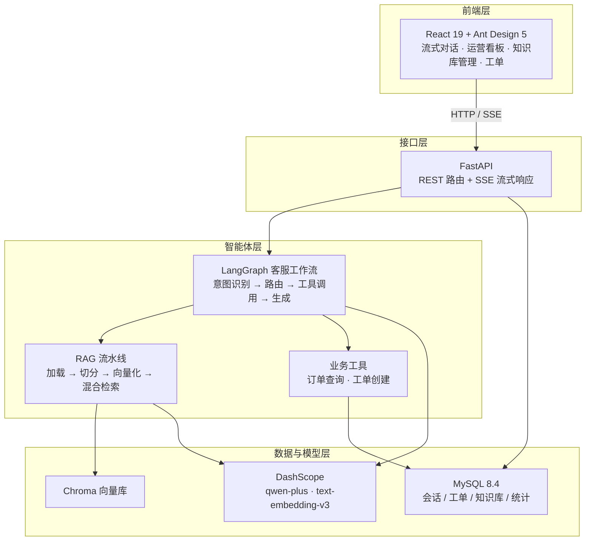
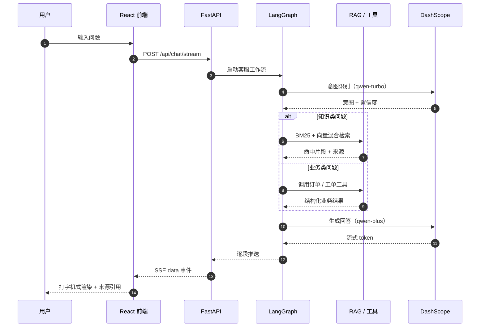

<h1 align="center">AI 智能客服系统</h1>

<p align="center">
  <b>面向电商客服场景的 RAG + 多智能体对话系统</b><br>
  <sub>React 19 · FastAPI · LangGraph · Chroma · MySQL 8.4 · DashScope</sub>
</p>

<p align="center">
  <a href="LICENSE"></a>
  
  
  
  
  
</p>

<p align="center">
  <a href="https://gitee.com/wmy221/faq-smart-ai-assistant"></a>
  <a href="https://gitee.com/wmy221/faq-smart-ai-assistant"></a>
</p>

---

|  |  |
| :--- | :--- |
| **一句话概括** | 用户提问 → 意图识别 → 分流到知识检索或业务工具 → 拼装上下文 → 流式生成带来源的回答 |
| **在线体验** | 启动即用，自动建表并写入演示数据，无需配置大模型 Key 也可跑通全流程 |

---

## 📖 项目简介

一个**前后端分离**的智能客服系统。项目把客服对话建模为 LangGraph 有向状态图，串联起意图识别、知识检索与业务工具调用：回答基于 RAG 检索结果生成并附带可追溯来源，同时支持在会话中直接查询订单、创建售后工单。前端提供流式对话、运营看板与知识库管理三块能力。

> 系统启动时自动建表并写入演示数据（商品 / FAQ / 工单），即使未配置大模型 API Key，数据库、会话、知识库、工单与统计等本地流程也完整可用。

---

## ✨ 功能亮点

| 能力 | 说明 |
| --- | --- |
| **多智能体工作流** | LangGraph 有向状态图：意图识别 → 路由 → 多轮工具调用 → 流式生成，状态贯穿整轮对话 |
| **RAG 知识库问答** | 文档加载（PDF / Word / Excel / Markdown）→ 切分 → Embedding 入库 → BM25 + 向量混合检索 → 来源引用 |
| **SSE 流式对话** | 打字机式逐段输出，前端增量解析，支持 Markdown 渲染与点赞 / 点踩反馈 |
| **业务工单闭环** | 会话中直接查询订单、一键创建售后工单，转人工无缝衔接 |
| **运营数据看板** | 会话趋势、意图分布、知识命中 Top 榜实时统计（ECharts） |
| **一键开箱体验** | 启动自动建表并写入演示数据，无需手动初始化 |

---

## 🖼️ 界面预览

<div align="center">

| 智能客服对话 | 运营数据看板 |
| :---: | :---: |
|  |  |

| 知识库管理 | RAG 检索测试 |
| :---: | :---: |
|  |  |

| 客服工单 |
| :---: |
|  |

</div>

> 截图来自本地演示环境（未配置大模型 API Key），展示完整的前后端交互与数据闭环。

---

## 🏗️ 核心架构



后端采用分层架构：`app/api`（路由）→ `app/services`（业务）→ `app/repositories`（数据访问）→ `app/models`（ORM 模型），另含 `app/core`（配置 / 中间件 / 异常 / 响应）、`app/rag`（RAG 流水线）、`app/graphs`（LangGraph 状态机）、`app/agents`（大模型封装）。

依赖方向自上而下单向流动，路由层不直接触碰数据库，业务逻辑不感知 HTTP 细节。

---

## 🔄 对话时序

一轮完整对话在服务端的流转过程：



---

## 🧩 技术选型

| 端 | 技术 |
| :---: | :--- |
| 前端 |       |
| 后端 |       |
| 数据 |    |
| 模型 |    |

---

## 🚀 快速开始

#### 1 · 启动 MySQL

```bash
docker compose up -d mysql
```

#### 2 · 启动后端

```bash
cd backend
python -m venv .venv
.venv\Scripts\activate                      # Windows；macOS/Linux 请使用 source .venv/bin/activate
pip install -r requirements.txt
copy .env.example .env                      # Windows；macOS/Linux 请使用 cp .env.example .env
uvicorn app.main:app --reload --port 8000
```

应用启动时会自动建表并写入演示数据（四类商品、FAQ、示例工单），便于直接体验。

#### 3 · 启动前端

```bash
cd frontend
npm install
npm run dev
```

#### 4 · 访问

| 服务 | 地址 |
| --- | --- |
| 前端应用 | http://localhost:5173 |
| 后端接口 | http://localhost:8000 |
| API 文档（Swagger） | http://localhost:8000/docs |

---

## ⚙️ 配置说明

模型 API Key **只通过 `backend/.env` 注入，不写入代码**：

```env
DASHSCOPE_API_KEY=请填写你的百炼 API Key
CHAT_MODEL=qwen-plus            # 对话模型
INTENT_MODEL=qwen-turbo         # 意图识别模型
EMBEDDING_MODEL=text-embedding-v3  # 向量模型
```

| 变量 | 说明 | 默认值 |
| --- | --- | --- |
| `DASHSCOPE_API_KEY` | 百炼平台 API Key，[申请地址](https://bailian.console.aliyun.com/) | 空 |
| `MYSQL_HOST / PORT / DATABASE / USERNAME / PASSWORD` | MySQL 连接配置 | localhost / 3306 / ai_customer_service / root / 123456 |
| `CHROMA_PERSIST_DIR` | Chroma 向量库持久化目录 | ./data/chroma |
| `UPLOAD_DIR` | 知识库文档上传目录 | ./data/uploads |
| `RAG_TOP_K` / `RAG_SCORE_THRESHOLD` | 检索数量与相关性阈值 | 5 / 0.35 |
| `INTENT_CONFIDENCE_THRESHOLD` | 意图识别置信度阈值 | 0.55 |
| `BACKEND_CORS_ORIGINS` | 允许的前端跨域来源 | http://localhost:5173,http://127.0.0.1:5173 |

未配置 API Key 时，系统仍可正常运行：数据库、会话、知识库、工单、统计等本地流程完整可用，大模型回答会返回明确的配置提示。

---

## 🔌 核心 API

| 方法 | 路径 | 说明 |
| --- | --- | --- |
| POST | `/api/chat/stream` | SSE 流式客服对话 |
| POST | `/api/chat` | 非流式客服对话 |
| GET/POST/DELETE | `/api/conversations` | 会话管理 |
| GET/POST/PUT/DELETE | `/api/knowledge-bases` | 知识库管理 |
| POST | `/api/knowledge-bases/{id}/documents` | 上传并向量化知识文档 |
| POST | `/api/retrieval/test` | 在线测试知识库检索 |
| GET/POST/PUT | `/api/tickets` | 工单管理 |
| POST | `/api/feedback` | 对话反馈 |
| GET | `/api/dashboard/statistics` | 运营数据统计 |
| GET | `/health` | 健康检查 |

---

## 🛠️ 工程亮点

- **LangGraph 状态机工作流**：客服对话被建模为有向状态图，意图识别 → 路由 → 多轮工具调用 → 流式生成，状态贯穿全程
- **标准 RAG 流水线**：文档加载（PDF/Word/Excel/Markdown）→ 文本切分 → Embedding 入库 → BM25 + 向量混合检索 → 来源引用
- **前后端深度集成**：SSE 流式解析、会话级状态管理（Zustand）、请求 ID 中间件与统一响应体
- **工程化细节**：统一异常处理、结构化日志、CORS 配置、自动建表与演示数据、一键环境脚本、冒烟测试

---

## 📁 项目结构

<details>
<summary>展开目录结构</summary>

```
ai-chat/
├── backend/                 # FastAPI 后端
│   ├── app/
│   │   ├── api/             # REST 路由（chat / knowledge / tickets / dashboard ...）
│   │   ├── agents/          # 大模型与意图识别封装
│   │   ├── core/            # 配置、日志、中间件、统一异常与响应
│   │   ├── db/              # 数据库会话与演示数据初始化
│   │   ├── graphs/          # LangGraph 客服工作流（状态机）
│   │   ├── models/          # SQLAlchemy ORM 模型
│   │   ├── rag/             # 文档加载、切分、向量化与检索
│   │   ├── repositories/    # 数据访问层
│   │   ├── schemas/         # Pydantic 请求/响应模型
│   │   ├── services/        # 业务逻辑层
│   │   └── tools/           # 客服可调用的业务工具
│   ├── scripts/             # 数据库初始化、冒烟测试等脚本
│   ├── tests/               # 单元测试
│   ├── requirements.txt
│   └── .env.example         # 环境变量模板
├── frontend/                # React 前端
│   └── src/
│       ├── pages/           # 聊天 / 看板 / 知识库 / 检索 / 工单页面
│       ├── api/             # Axios 请求封装
│       ├── stores/          # Zustand 状态管理
│       └── router/          # 前端路由
├── docker-compose.yml       # MySQL 开发环境
└── README.md
```

</details>

---

## ✅ 测试

```bash
cd backend
pytest tests/
```

---

<p align="center">
  <sub>MIT License · 由 <a href="https://gitee.com/wmy221/faq-smart-ai-assistant">Gitee</a> 托管</sub>
</p>